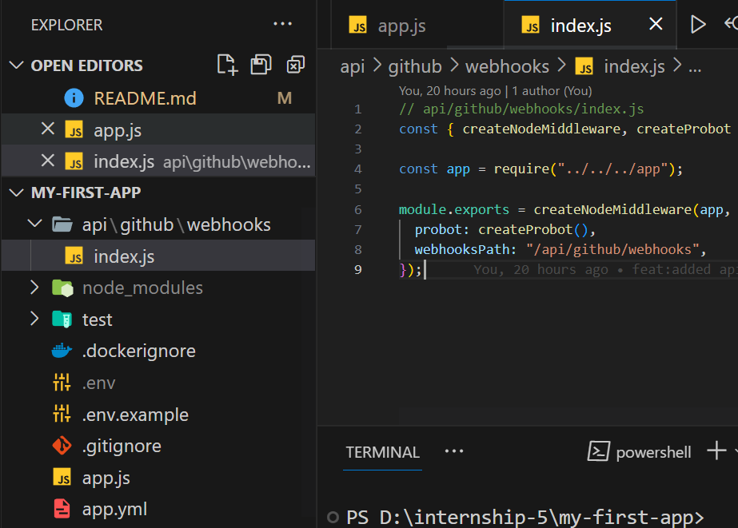

# Code-Solver

>  A GitHub App built with [Probot](https://github.com/probot/probot) that solves a piece of code given in in the description whenever the issue is opened.

## Setup

```sh
# Install dependencies
npm install

# Run the bot
npm start or npm run dev
```

## Video sample:

<a>https://drive.google.com/file/d/1TBBlBSncNzmZifezHGYdkNZuiZ6jgrIR/view?usp=sharing</a>

## Developement approach

<li>First the basic template was downloaded from https://probot.github.io/docs/development/</li>
<li>Then created the project using</li>

```sh
npx create-probot-app my-first-app
```

<li>customised the piece of code inside index.js as follows</li>

```sh

const axios = require("axios");
/**
 * This is the main entrypoint to your Probot app
 * @param {import('probot').Probot} app
 */
module.exports = (app) => {
  // Your code here
  app.log.info("Yay, the app was loaded!");

  app.on("issues.opened", async (context) => {
 
    const issue=context.payload.issue

    console.log("this is the body"+issue.body)
    var finalResult;
    let errorMsg = "Sorry, I couldn't compile your code. Please check your code and try again."

  const options = {
    method: 'POST',
    url: 'https://online-code-compiler.p.rapidapi.com/v1/',
    headers: {
      'content-type': 'application/json',
      'X-RapidAPI-Key': process.env.RAPID_API_KEY,
      'X-RapidAPI-Host': 'online-code-compiler.p.rapidapi.com'
    },
    data: {
      language: 'cpp',
      version: 'latest',
      code: `${issue.body}`,
      input: null
    }
  };
  
  try {
    const response = await axios.request(options);
    console.log(response.data.output);
    finalResult="output: "+response.data.output;
  } catch (error) {
    console.error(error);
    finalResult=errorMsg;
  }
  

    const issueComment = context.issue({
      body: finalResult,
    });
    return context.octokit.issues.createComment(issueComment);
  });

};

```

<li>Then simply start the server locally</li>

<li>Install it on the github repository and now test the product by creating a new issue</li>
<li>In order to run globally , I have deployed it on vercel as a serverless function. The api folder has a file named index.js which has the necessity middleware and make it run as a serverless function</li>

<br/>



## Deployement
The product is depoyed at vercel. 


## Dependencies
<li>Axios for API request</li>
<li>Rapid API compiler  for compilation of code</li>
<li>Nodemon for dev environment</li>

## Contributing

If you have suggestions for how my-first-app could be improved, or want to report a bug, open an issue! We'd love all and any contributions.

For more, check out the [Contributing Guide](CONTRIBUTING.md).

## License

[ISC](LICENSE) © 2023 SySagar
